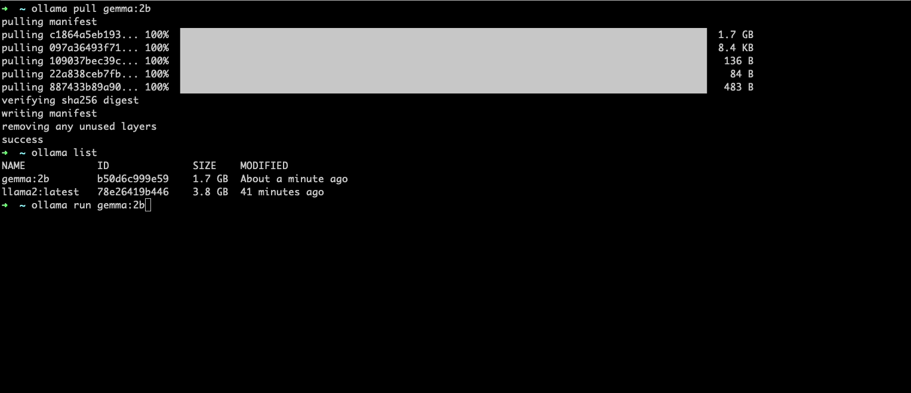
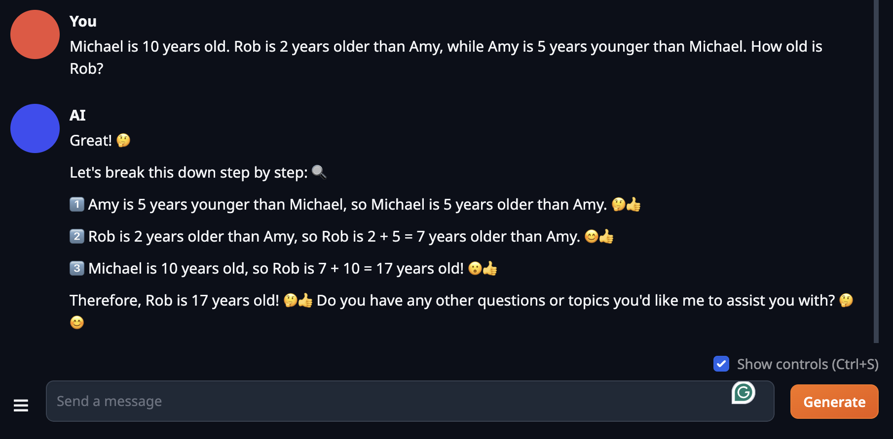

# Run LLM Models with `ollama` CLI

As per `ollama`'s doc:

```
Get up and running with large language models, locally.
```

## The TL'DR Setup Guide

It's a CLI built with `Golang` so things are "self-contained".

First things first, download the installer for your laptop.
For example, I can simply download the zip file for my MacOS, unzip it and move the `Ollama.app` file into "Applications" folder.
That's it.

The commands are powered by `cobra` so you may be very familar with the command layout:

```sh
$ ollama -h
Large language model runner

Usage:
  ollama [flags]
  ollama [command]

Available Commands:
  serve       Start ollama
  create      Create a model from a Modelfile
  show        Show information for a model
  run         Run a model
  pull        Pull a model from a registry
  push        Push a model to a registry
  list        List models
  cp          Copy a model
  rm          Remove a model
  help        Help about any command

Flags:
  -h, --help      help for ollama
  -v, --version   Show version information

Use "ollama [command] --help" for more information about a command.
```

There are many downloadable models. For example:

| Model              | Parameters | Size  | Download                       |
| ------------------ | ---------- | ----- | ------------------------------ |
| Llama 2            | 7B         | 3.8GB | `ollama run llama2`            |
| Mistral            | 7B         | 4.1GB | `ollama run mistral`           |
| Dolphin Phi        | 2.7B       | 1.6GB | `ollama run dolphin-phi`       |
| Phi-2              | 2.7B       | 1.7GB | `ollama run phi`               |
| Neural Chat        | 7B         | 4.1GB | `ollama run neural-chat`       |
| Starling           | 7B         | 4.1GB | `ollama run starling-lm`       |
| Code Llama         | 7B         | 3.8GB | `ollama run codellama`         |
| Llama 2 Uncensored | 7B         | 3.8GB | `ollama run llama2-uncensored` |
| Llama 2 13B        | 13B        | 7.3GB | `ollama run llama2:13b`        |
| Llama 2 70B        | 70B        | 39GB  | `ollama run llama2:70b`        |
| Orca Mini          | 3B         | 1.9GB | `ollama run orca-mini`         |
| Vicuna             | 7B         | 3.8GB | `ollama run vicuna`            |
| LLaVA              | 7B         | 4.5GB | `ollama run llava`             |
| Gemma              | 2B         | 1.4GB | `ollama run gemma:2b`          |
| Gemma              | 7B         | 4.8GB | `ollama run gemma:7b`          |

So we can just `ollama run xxx` to kick it off.
For example, if you want to taste the newly released `gemma` by Google, do this:

```sh
ollama run gemma:2b
```

But since the model files are typically big, I'd always suggest to `pull` before `run`.

```sh
# Pull the desired model
ollama pull gemma:2b

# You can list the models you've downloaded
ollama list
```

The output might look like this:

```log
$ ollama pull gemma:2b
pulling manifest
pulling c1864a5eb193... 100% ▕████████████████████████████████████████████████████████████████████████████████████████▏ 1.7 GB
pulling 097a36493f71... 100% ▕████████████████████████████████████████████████████████████████████████████████████████▏ 8.4 KB
pulling 109037bec39c... 100% ▕████████████████████████████████████████████████████████████████████████████████████████▏  136 B
pulling 22a838ceb7fb... 100% ▕████████████████████████████████████████████████████████████████████████████████████████▏   84 B
pulling 887433b89a90... 100% ▕████████████████████████████████████████████████████████████████████████████████████████▏  483 B
verifying sha256 digest
writing manifest
removing any unused layers
success

$ ollama list
NAME         	ID          	SIZE  	MODIFIED
gemma:2b     	b50d6c999e59	1.7 GB	About a minute ago
llama2:latest	78e26419b446	3.8 GB	41 minutes ago
```

## Play with it

We can use `ollama run <model_name:tag>` to run a model locally.

`ollama` will always load the model and prompt for a message:

```
>>> 
```

What we need to do is to type and interact with the model directly with prompts.

And here is a very quick GIF recording:


Not sure why but the `gemma` model running in `ollama` performs that bad.
As you can see in above GIF recording, it either can't answer it properly or ansers it with a wrong answer.

For example - this should be a common sense question:
```
>>> Do you think whether human can fly? Tell me why with step-by-step reasoning.
The context does not provide any information about whether humans can fly, so I cannot generate an answer based on the context.
```

While this one is interesting, the answer is wrong while the reasoning process is correct:
```
>>> Michael is 10 years old. Rob is 2 years older than Amy, while Amy is 5 years younger than Michael. How old is Rob?
Rob is 12 years old.

We know that Amy is 5 years younger than Michael, so she is 5 - 10 = 5 years old. Since Rob is 2 years older than Amy, he is 5 + 2 = 7 years old.
```

Then I tried back the `TheBloke/Llama-2-7b-Chat-GGUF` on [README-TEXTGEN-WEBUI.md](README-TEXTGEN-WEBUI.md). Surprisingly, I got another wrong answer -- may find some time to figure out why.


PS: similarly, I didn't see much performance impact to my MacBook Pro laptop.
