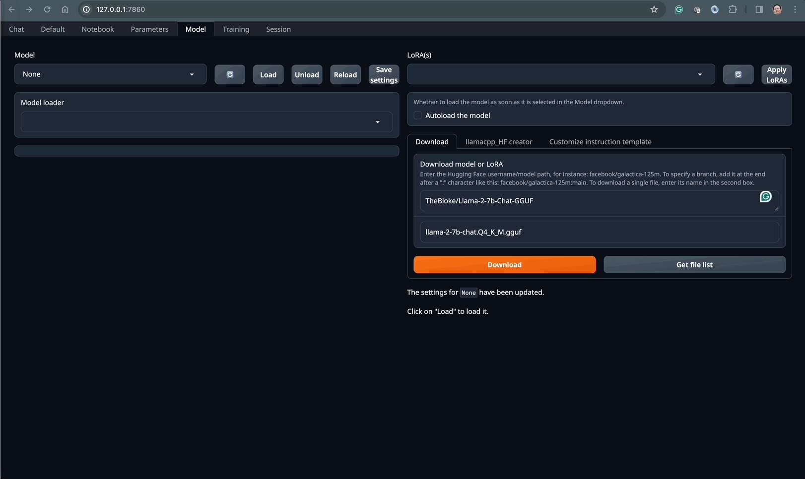

# Run LLM Models in the popular web UI `text-generation-webui`

The [`text-generation-webui`](https://github.com/oobabooga/text-generation-webui) is a popular web UI to load, tune and run LLM models.

As per its doc:

```
A Gradio web UI for Large Language Models.

Its goal is to become the AUTOMATIC1111/stable-diffusion-webui of text generation.
```

## The TL'DR Setup Guide

It provides `start_xxx.sh` or `start_xxx.bat` file that can be used to quickly set up and bootstrap the application.
But it would start from installing `Miniconda` that we've done while preparation.

So let's try it manually with slightly more steps:

```sh
# Deactivate current env, if any
conda deactivate
# Use conda to create a new Python env
conda create -n textgen python=3.11
conda activate textgen

# Clone the project
git clone https://github.com/oobabooga/text-generation-webui
cd text-generation-webui/

# Install Pytorch
pip3 install torch=="2.1.*" torchvision=="0.16.*" torchaudio=="2.1.*"

# Install all required libs
pip install -r requirements_apple_silicon.txt

# Start the server
python server.py
```

## Play with it

The server will be listening on: http://127.0.0.1:7860/.

Open a browser and navigate to the UI, which is quite pretty.

Firstly, we need to download and load the desired LLM models.
Since we've tried `TheBloke/Llama-2-7b-Chat-GGUF`'s `llama-2-7b-chat.Q4_K_M.gguf` in [localGPT experiment](./README-LOCALGPT.md), let's try the same model.
Click the Model tab -> in the "Download model or LoRA" form, key in:
- `TheBloke/Llama-2-7b-Chat-GGUF`
- `llama-2-7b-chat.Q4_K_M.gguf`

Then click "Download" button to download the model.

Once it's downloaded, click the refresh icon to refresh the list of models.

Then pick the `llama-2-7b-chat.Q4_K_M.gguf` model from the dropdown list and click "Load" button to load the model into the memory.

Optionally, you may tune further on the model settings.

Now, we can chat with the model by clicking the "Chat" tab and start sending the messages.

The model has been well trained with great knowledge so you may try something like what I did:
- Write a Java application where it has a sum method which can be used to calculate the sum of two integers.
- Tell me a joke.
- ...

And here is a very quick GIF recording:


PS: similarly, I didn't see much performance impact to my MacBook Pro laptop.
